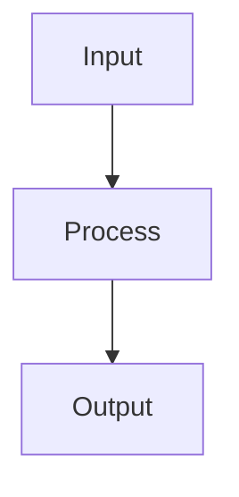

<p align="center">
  
</p>

<h1 align="center">mdr — Markdown Reader (oxgenet fork)</h1>

<p align="center">
  A lightweight, fast Markdown viewer and editor with Mermaid diagram support, live reload, and CJK-aware rendering. Built in Rust.
</p>

> **This is a fork.** The original mdr is by [Clever Cloud](https://github.com/CleverCloud/mdr) (MIT).
> This fork (https://github.com/oxgenet/mdr) is maintained by Opusify IT Solutions Pvt. Ltd. and is not affiliated
> with Clever Cloud. Package names are namespaced (`oxgenet/tap/mdr`, `opusify.mdr`, …) so they do not
> collide with the original. Provenance and attribution: [NOTICE.md](NOTICE.md). License: [LICENSE](LICENSE).

## Why mdr?

**Built for the LLM era.** AI tools generate Markdown constantly — code documentation, technical specs, analysis reports — packed with diagrams, tables, and structured content. You need a fast way to read them.

Most developers end up previewing Markdown in VS Code, pasting into a browser, or squinting at raw text in the terminal. None of these handle Mermaid diagrams. None are instant. mdr is.

- **One command** — `mdr file.md` and you're reading, not editing
- **Native Rust binary** — no Electron, no Node.js, no npm, starts in milliseconds
- **Mermaid diagrams** — flowcharts, sequence diagrams, pie charts rendered as SVG natively (no headless browser)
- **Three backends** — full GUI (egui), native webview (WebKit/WebView2), or terminal UI (TUI) over SSH
- **Live reload** — edit your file or let your AI tool regenerate it, see changes instantly
- **In-document search** — Ctrl+F / `/` to find text across all backends

## Backends

mdr offers multiple rendering backends, selectable at runtime:

| Backend | Stack | Strengths |
|---------|-------|-----------|
| **egui** (default) | Pure Rust GPU rendering | Single static binary, fast startup, cross-platform |
| **webview** | OS native WebView (WebKit/WebView2) | GitHub-quality HTML/CSS rendering, full CSS support |
| **tui** | Terminal UI (ratatui + crossterm) | Works over SSH, no GUI needed, keyboard-driven |

## Install

### From source

```bash
git clone https://github.com/oxgenet/mdr.git
cd mdr
cargo install --path .
```

### Build with specific backends only

```bash
# egui only (smaller binary, no WebView dependency)
cargo install --path . --no-default-features --features egui-backend

# webview only
cargo install --path . --no-default-features --features webview-backend
```

### Homebrew (macOS/Linux)

```bash
brew install oxgenet/tap/mdr   # oxgenet fork (conflicts with CleverCloud/misc/mdr)
```

### Snap (Linux)

```bash
sudo snap install --edge mdr-markdown-renderer
```

> **Note**: The snap command is `mdr-markdown-renderer`, not `mdr`. You can create an alias: `sudo snap alias mdr-markdown-renderer mdr`

### Scoop (Windows)

```powershell
scoop bucket add oxgenet https://github.com/oxgenet/scoop-bucket
scoop install oxgenet/mdr
```

### Chocolatey (Windows)

```powershell
choco install mdr
```

### WinGet (Windows)

```powershell
winget install opusify.mdr
```

### Nix

```bash
nix run github:oxgenet/mdr   # flake kept from upstream, untested by the fork
```

### Pre-built binaries

Download from the [Releases](https://github.com/oxgenet/mdr/releases) page for macOS, Linux, and Windows.

### macOS app (Mdr.app)

`Mdr.app` wraps the same `mdr` binary in a macOS bundle, so it can live in
`/Applications`, sit in the Dock, and open Markdown files by double-click or
drag & drop. Two assets are published per release:

| Asset | Use |
|---|---|
| `Mdr-X.Y.Z-macos-universal.dmg` | drag-install into `/Applications` |
| `Mdr-X.Y.Z-macos-universal.zip` | scripted installs |

Both are **universal** (Apple Silicon + Intel).

#### Removing the quarantine flag (required)

The bundle is **ad-hoc signed, not notarized** (no Apple Developer account), so
Gatekeeper refuses it with *"Mdr" is damaged and can't be opened* until the
quarantine attribute Safari/Chrome attached to the download is removed:

```bash
# after dragging Mdr.app into /Applications
xattr -dr com.apple.quarantine /Applications/Mdr.app
open /Applications/Mdr.app
```

For the `.zip`, do the same after unzipping. To inspect first:

```bash
xattr -l /Applications/Mdr.app          # com.apple.quarantine present?
codesign --verify --verbose=2 /Applications/Mdr.app
```

There is also the GUI route — right-click Mdr.app → **Open** → *Open* in the
dialog (macOS 14 and earlier), or **System Settings → Privacy & Security →
Open Anyway** (macOS 15+). The `xattr` command is the one that works
unattended, in scripts and over SSH.

#### Opening documents

- **Double-click** a `.md` file, or Finder → *Open With* → Mdr
- **Drag & drop** a Markdown file onto the window — including onto the empty
  window you get by launching the app on its own. Dropping a second file
  replaces what is displayed
- **Relative links** (`[notes](./sub/b.md)`) are resolved against the
  *currently open* document's directory and opened in the same window, so a
  tree of notes stays navigable. Images resolve the same way

#### Opening the app from a shell

```bash
# Same path Finder's "Open With" takes. Relative paths are fine, and if Mdr is
# already running the open document is replaced in the existing window.
open -a Mdr README.md
```

Options cannot ride along on this route: Finder and `open -a` deliver the file
as an Apple Event (`kAEOpenDocuments`), which carries a path and nothing else.
To pass options, run the bundled binary — it is the ordinary CLI binary, so
everything in `mdr --help` works and each invocation gets its own window:

```bash
/Applications/Mdr.app/Contents/MacOS/mdr --edit --toc README.md
```

You only need that path once. `--install-cli` symlinks the bundled binary into
`~/.local/bin` (user-writable, no `sudo`), so `mdr` in the terminal and Mdr.app
in the Dock stay the same build — a new release replaces both at once:

```bash
/Applications/Mdr.app/Contents/MacOS/mdr --install-cli
# ~/.local/bin/mdr -> /Applications/Mdr.app/Contents/MacOS/mdr

mdr --edit README.md
```

It prints the `export PATH=...` line to add to `~/.zshrc` if that directory is
not on your PATH yet, and takes `--prefix <DIR>` for somewhere else
(`--prefix /usr/local/bin` needs `sudo`). Re-running it is safe: it replaces
its own symlink, and refuses to overwrite a real `mdr` binary installed by
Homebrew or `cargo install`.

Adding the bundle directory to PATH directly works too, and survives without
any symlink:

```bash
echo 'export PATH="/Applications/Mdr.app/Contents/MacOS:$PATH"' >> ~/.zshrc
```

For options that should apply to **documents opened from Finder**, use the
config file instead — that is the only channel a double-click can carry them
through:

```kdl
// ~/.config/mdr/config.kdl  (create with: mdr --init)
mode editor   // always open in editor mode
toc #true     // show the table of contents sidebar
```

CLI flags override the config file, so Finder can default to editor mode while
`mdr README.md` in a terminal still opens the plain viewer.

## Usage

```bash
# Open with default backend (egui)
mdr README.md

# Open with webview backend
mdr --backend webview README.md

# Open in terminal (TUI)
mdr --backend tui README.md

# Show help
mdr --help

# Empty window — drop a Markdown file onto it (webview backend)
mdr --new
```

### Webview: viewer and editor modes

The webview backend opens in **viewer mode** by default: only the rendered
document is shown, with no sidebar or toolbar. A small `⋮` menu in the top-right
corner switches between modes:

- **Editor mode** — a source pane on the left with live preview on the right.
  `Cmd+S` / `Ctrl+S` (or the menu's *Save*) writes the file back to disk.
- **Show / hide table of contents** — toggles the heading sidebar.

```bash
# Start directly in editor mode
mdr --edit README.md

# Start with the table of contents visible
mdr --toc README.md
```

`mdr --new` opens the same window with no document loaded; drop a file onto it
to start. This is what Mdr.app does when launched from Finder or the Dock,
where there are no arguments and no stdin to read from.

Both can also be set in `~/.config/mdr/config.kdl`:

```kdl
mode editor   // viewer (default) or editor
toc #true     // show the sidebar at startup
```

### CJK rendering: Japanese, Simplified / Traditional Chinese, Korean

The rendered page carries a `lang` attribute so the browser picks the right
glyph shapes (e.g. 直, 骨, 令 differ between ja / zh-Hans / zh-Hant) and the
matching system fonts via `:lang()` CSS — for body text, code, the editor pane,
and inline Mermaid diagrams. The language is resolved in this order:

1. `lang:` in the document's YAML front matter (`lang: zh-Hant`)
2. `--lang <tag>` on the command line, or `lang "<tag>"` in `config.kdl`
3. Content detection: kana → `ja`, Hangul → `ko`, Bopomofo → `zh-Hant`, and
   for Han-only text a vote over characters that are distinctive to Simplified
   or Traditional Chinese (`zh-Hans` / `zh-Hant`)
4. The OS locale (`LC_ALL` / `LANG`)
5. Otherwise no attribute is set (Latin-script documents are untouched)

Kanji-only Japanese cannot be told apart from Chinese by content alone; give it
`lang: ja` in the front matter or start with `--lang ja`. Mixed documents can
override per block with raw HTML: `<div lang="ko">…</div>`.

```bash
mdr --lang zh-Hant notes.md
```

### iOS app (document-based, like a PDF viewer for `.md`)

`ios/MdrApp` is a small Swift shell around the Rust core (`libmdr.a`, C ABI in
`ios/mdr_core.h`). It behaves the way PDF apps do for PDFs:

- registers the Markdown document type, so `.md` attachments in Mail / Files /
  share sheets open in mdr ("Open in mdr", `LSHandlerRank = Owner`)
- starts in the system document browser (Recents / Shared / Browse, iCloud
  Drive and other Files providers)
- opens files **in place** through `UIDocument` (`LSSupportsOpeningDocumentsInPlace`):
  edits are written back to the original file with autosave
- viewer with Done / table of contents / search / edit (pen) / share; the
  navigation bar hides on scroll
- edit mode: native text view (IME, undo, dictation) with a Markdown syntax
  bar above the keyboard and live preview below
- share as `.md` or as PDF

```bash
brew install xcodegen
rustup target add aarch64-apple-ios-sim
ios/build-app.sh tests/samples/lang/ja.md     # build core + app, install on a simulator, open, screenshot, assert
```

Verified on the iPhone simulator: open from the document browser, edit with
live preview and in-place autosave, native table of contents sheet, native
search bar with match count and highlights, insert a photo from the library
(saved next to the document, downscaled to 2048 px), share as `.md` or PDF
(`WKWebView.createPDF`, CJK fonts and vector Mermaid preserved).

The Share Extension (`ios/MdrShare`) appears in other apps' share sheets and
hands text / files to the app through the App Group `group.net.oxge.mdr`.
App Groups need a signed build, so on an unsigned simulator build the
extension launches but cannot deliver the file.

Device / TestFlight builds need an Apple Developer Team ID:

```bash
DEVELOPMENT_TEAM=ABCDE12345 ios/build-device.sh              # signed archive + ad-hoc .ipa
DEVELOPMENT_TEAM=ABCDE12345 ASC_KEY_ID=… ASC_ISSUER_ID=… ASC_KEY_PATH=… ios/build-device.sh --upload
```

`scripts/ios-sim.sh` is the older, chrome-less test bed (tao window + bundled document).

### Remote images (http / https policy)

Images referenced by URL are loaded by the webview under a fixed policy,
enforced in the Rust core before the page is built:

| URL | Result |
|---|---|
| `https://…` | loaded (lazily) |
| `http://localhost`, `http://127.0.0.1`, `http://[::1]`, `http://10.x`, `172.16–31.x`, `192.168.x`, `169.254.x`, `fc00::/7`, `fe80::/10`, `http://*.local` — on ports 80, 8080, 8443, 3000–3999, 5000–5999, 8000–8999, 9000–9999 | loaded (plain http is fine inside your own network) |
| `http://` to any other host or port, credentials in the URL, other schemes | replaced by a placeholder showing the URL |

Only IP literals and `*.local` names qualify as local; hostnames that merely
resolve to a private address are not looked up (no DNS rebinding). Images that
fail to load (offline, 404) become a placeholder too, and the page stays usable.

```bash
mdr --no-remote-images notes.md   # never fetch URL images
mdr --no-local-http notes.md      # https only
```

`config.kdl`: `remote-images #false`, `allow-local-http #false`. The iOS app
declares `NSAllowsLocalNetworking` for the same behaviour.

### TUI keybindings

| Key | Action |
|-----|--------|
| `q` / `Esc` | Quit |
| `j` / `↓` | Scroll down |
| `k` / `↑` | Scroll up |
| `Space` / `PgDn` | Page down |
| `PgUp` | Page up |
| `g` / `Home` | Go to top |
| `G` / `End` | Go to bottom |
| `Tab` | Switch focus between TOC and content |
| `Enter` | Navigate to selected TOC heading |
| `/` or `Ctrl+F` | Open search |
| `n` | Next search match |
| `N` | Previous search match |

## Features

- **Full GFM support** — tables, task lists, strikethrough, footnotes, autolinks
- **Syntax highlighting** — code blocks with language detection (via syntect)
- **Mermaid diagrams** — flowcharts, sequence diagrams, pie charts, and more (via mermaid-rs-renderer)
- **Table of Contents** — auto-generated sidebar from headings with click-to-navigate
- **Live reload** — file watching with 300ms debounce, updates on save
- **Dark/Light theme** — follows OS theme (webview backend)

## Mermaid Support

Mermaid code fences are rendered as SVG diagrams:

````markdown

````

Supported diagram types: flowchart, sequence, pie, class, state, ER, gantt.

Diamond/decision nodes (`{text}`) render correctly as of mermaid-rs-renderer
0.2.2 — the note that previously said otherwise was stale. `tests/samples/mermaid/complex.md`
exercises each supported diagram type, and anything the Rust renderer cannot
draw falls back to the bundled mermaid.js rather than failing.

## Architecture

```
src/
├── main.rs              # CLI (clap), backend dispatch
├── core/
│   ├── markdown.rs      # GFM parsing (comrak) + CSS
│   ├── mermaid.rs       # Mermaid → SVG rendering
│   ├── toc.rs           # Heading extraction for TOC
│   ├── search.rs       # In-document search
│   └── watcher.rs       # File watching (notify, 300ms debounce)
└── backend/
    ├── egui.rs          # egui/eframe backend
    ├── tui.rs           # ratatui/crossterm TUI backend
    └── webview.rs       # wry/tao WebView backend
```

## Building

Requires Rust 1.75+.

```bash
# All backends (default)
cargo build --release

# Run tests
cargo test

# Run clippy
cargo clippy
```

### Linux dependencies

```bash
sudo apt-get install libgtk-3-dev libwebkit2gtk-4.1-dev libxdo-dev libgl1-mesa-dev
```

## Releases

Pre-built binaries are available on the [Releases](https://github.com/oxgenet/mdr/releases) page for:
- macOS (Apple Silicon + Intel)
- Linux (x86_64)
- Windows (x86_64)

To create a release, push a version tag:

```bash
git tag v0.1.0
git push origin v0.1.0
```

## License

MIT. Copyright (c) 2026 Clever Cloud (original work) and Copyright (c) 2026 Opusify IT Solutions Pvt. Ltd.
(fork modifications). See [LICENSE](LICENSE) and [NOTICE.md](NOTICE.md). Packagers: ship both files.

## Contributing

Issues and PRs for **this fork** at [github.com/oxgenet/mdr](https://github.com/oxgenet/mdr).
For the original project use [github.com/CleverCloud/mdr](https://github.com/CleverCloud/mdr).
