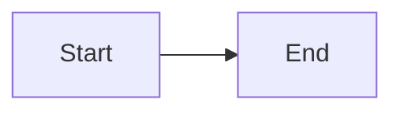
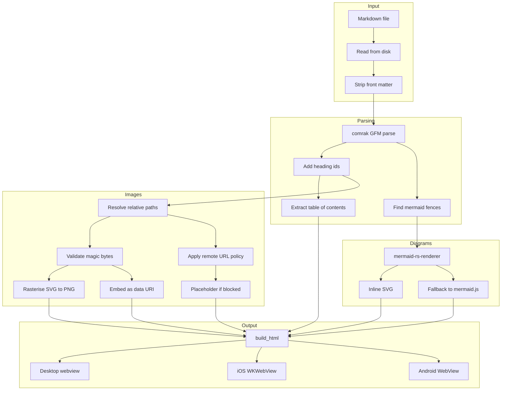
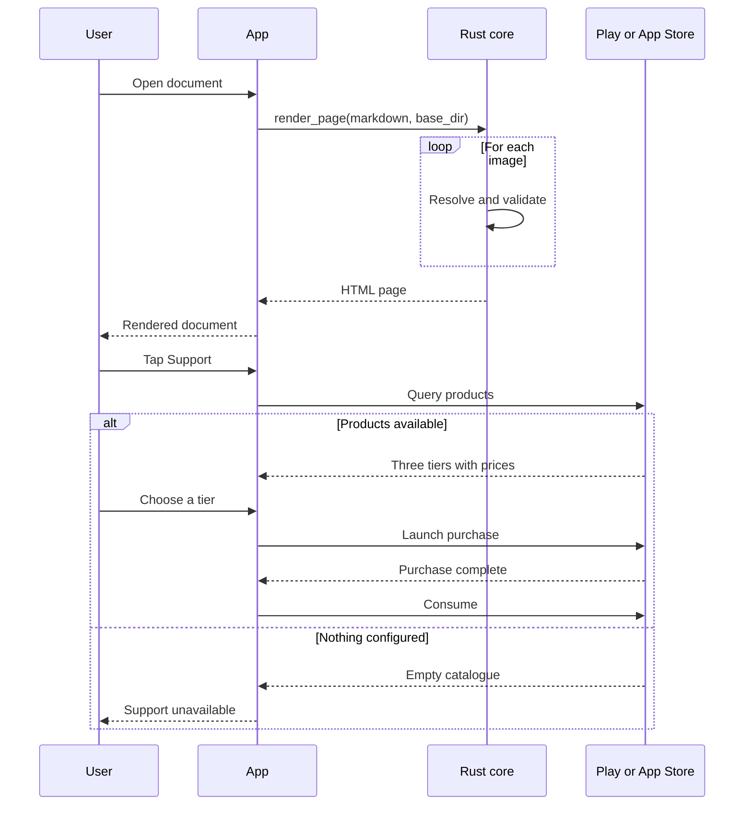
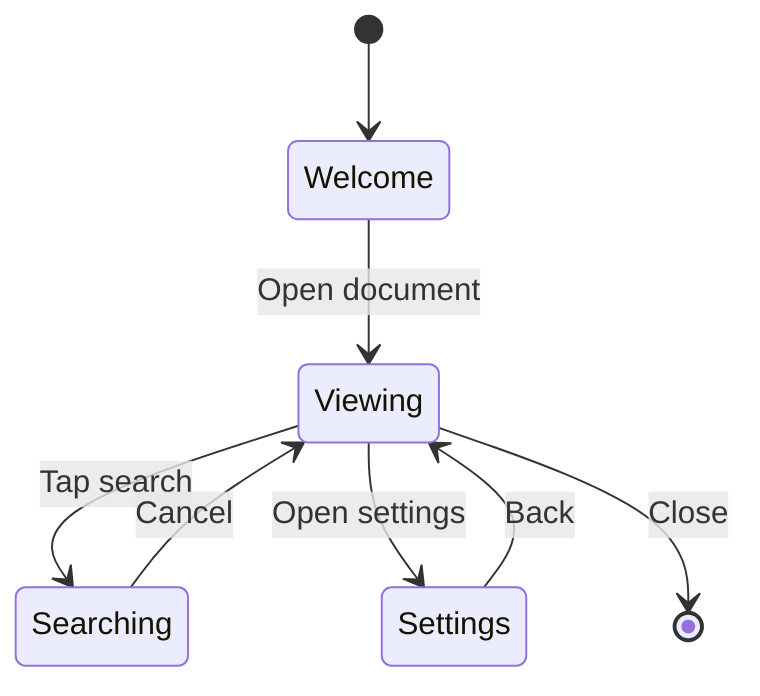
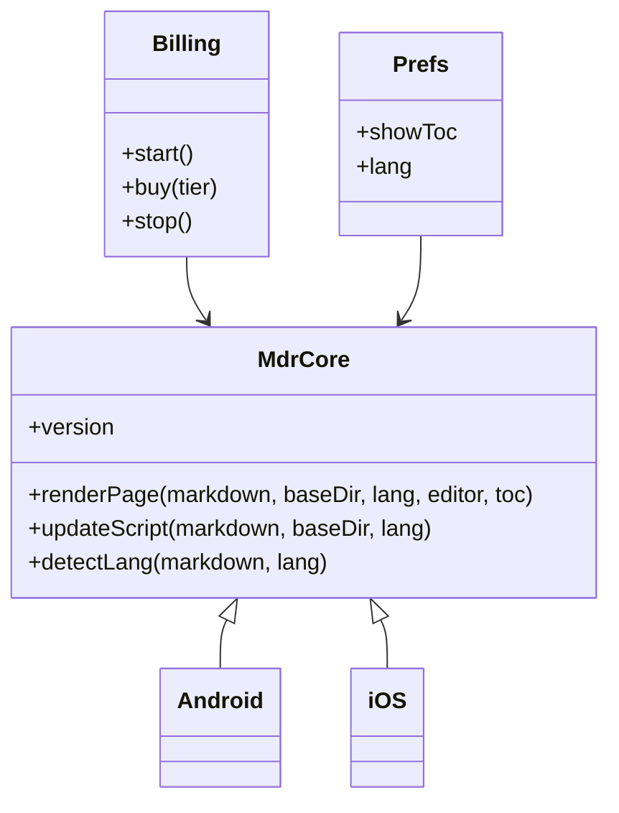
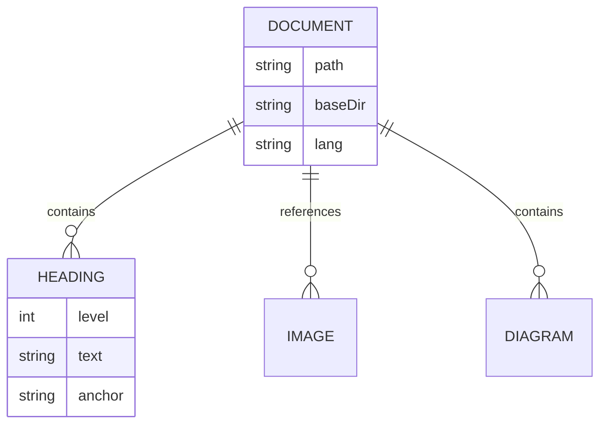
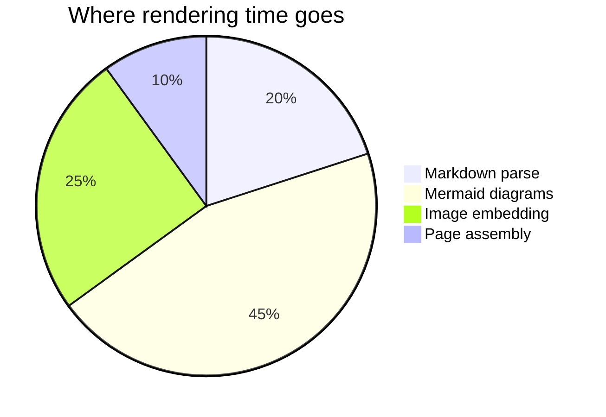
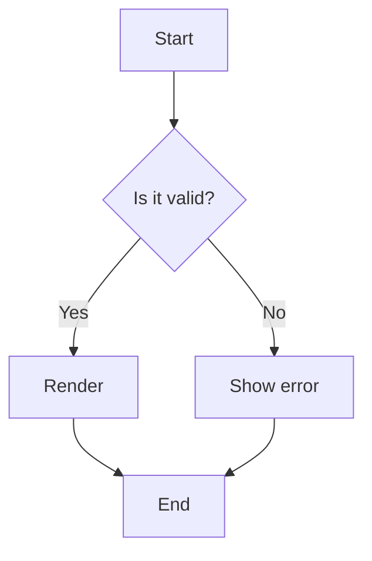
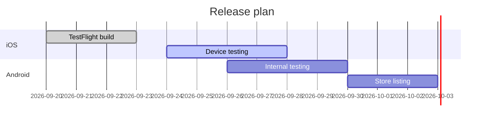

# Mermaid rendering test

Sample content for checking diagram rendering, sizing and zoom behaviour on
phones. Ordered deliberately: the first two diagrams test *size* handling at
both extremes, the rest cover diagram types the renderer supports to differing
degrees.

## 1. A deliberately tiny diagram

Two nodes, nothing more. It should render small. If it is stretched to the full
width of the column, the page CSS is forcing `width: 100%` on every SVG.

## 2. A deliberately large diagram

Wide and deep, with subgraphs. On a phone this must shrink to fit, stay
legible, and be pinch-zoomable to read the labels.

## 3. Sequence diagram with loops and alternatives

## 4. State diagram

## 5. Class diagram

## 6. Entity relationship diagram

## 7. Pie chart

## 8. Japanese labels

CJK text inside a diagram uses the font stack the document language selects,
so this should render in a Japanese face rather than a fallback.

## 9. Decision nodes — known unsupported

The Rust renderer does not support diamond/decision nodes (`{text}`). This
should fall back to mermaid.js rather than failing, which is the behaviour
worth confirming on a phone, where the fallback script also has to run.

## 10. Gantt

